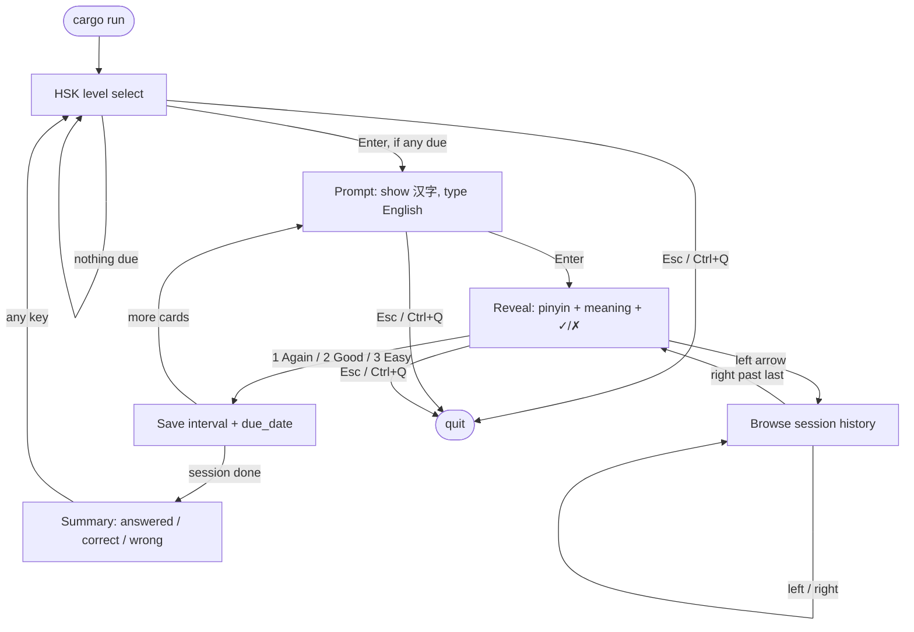

# Mandarin SRS

A terminal spaced-repetition app for Mandarin: you see **汉字**, type the **English meaning**, then rate how well you knew it. Pinyin and the gloss stay hidden until after you answer.

Built as a small Rust + [ratatui](https://ratatui.rs/) TUI. Deck data is HSK 2.0 vocabulary (levels 1–4 full exclusive lists; 5–6 are samples). Progress is stored locally as JSON.

## Requirements

- Rust toolchain (edition 2024; `rustup` stable is fine)
- A terminal that can show CJK (most modern terminals)
- Run from the **crate root** so `data/hsk_words.json` resolves

## Run

```bash
cargo run
```

First launch creates `data/progress.json` as you grade cards. That file is yours (intervals and due dates); it is safe to delete if you want a clean slate.

```bash
cargo test    # domain tests (matching, intervals, due dates)
```

## Keys

| Where | Keys |
|-------|------|
| **Level select** | `↑` `↓` / `j` `k` · `1`–`6` · `Enter` start |
| **Prompt** | type English · `Enter` check · `Backspace` |
| **Reveal** | `1` / `a` Again · `2` / `g` Good · `3` / `e` Easy · `←` browse |
| **Browse** | `←` `→` history (read-only) · `→` past last returns to reveal/quiz |
| **Summary** | any key → level select |
| **Anywhere** | `Esc` or `Ctrl+Q` quit |

Answers are lenient: case, extra spaces, and either side of a `;` gloss (`dad` or `father`).

Scheduling (after you press 1/2/3):

| Grade | Next due |
|-------|----------|
| Again | today |
| Good | previous interval × 2 (min 2 days from new) |
| Easy | previous interval × 4 |

A session is up to **50 due** cards at the chosen HSK level (shuffled). Cards not due yet are skipped.

## Interaction flow



Text version of the same loop:

```text
  cargo run
      │
      ▼
 ┌─ HSK select (due / total per level) ◄──────────────┐
 │        Enter                                       │
 ▼                                                    │
 Prompt (汉字) ──Enter──► Reveal                      │
                            │                         │
                   1 / 2 / 3 grade + save             │
                            │                         │
              more cards ───┴─── last card            │
                   │                    │             │
                   ▼                    ▼             │
                Prompt              Summary ──any key─┘
```

## Data

| File | Role |
|------|------|
| `data/hsk_words.json` | Deck: `chinese`, `pinyin`, `meaning`, `hsk` (1–6) |
| `data/progress.json` | Per-card `interval_days` and `due_date` (`YYYY-MM-DD`), keyed by `hskN:汉字` |

Word counts (HSK 2.0 exclusive lists): L1 150 · L2 ~150 · L3 300 · L4 ~600 · L5–6 samples.

## Layout (code)

```text
src/main.rs          load deck + progress, run TUI
src/models/          Card, Deck, progress, next_interval
src/app/tui/         terminal loop, App state, keys, view
src/utils/           calendar today()
```
